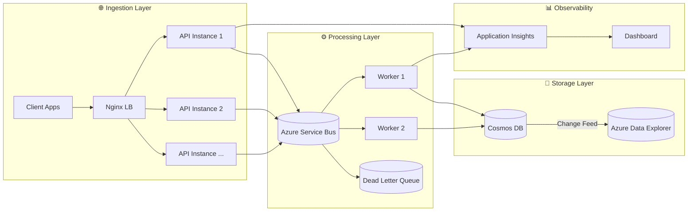

# ☁️ CloudScale Event Intelligence Platform

**Production-grade, high-throughput event ingestion and real-time analytics system designed for 10k+ events/min with sub-200ms latency.**

[](https://dotnet.microsoft.com/)
[](https://azure.microsoft.com/)
[](LICENSE)
[](/.github/workflows/ci-cd.yml)

---

## 🎯 Mission

Enable enterprises to ingest, process, and analyze millions of user behavior events in real-time with **99.9% availability**, **fraud detection**, and **actionable insights** — all on Azure-native infrastructure.

---

## 🏗️ Architecture Overview



### Component Responsibilities

| Component | Technology | Purpose |
|-----------|------------|---------|
| **Ingestion API** | .NET 8 Minimal API | High-performance event intake with validation |
| **Load Balancer** | Nginx | Distributes traffic across API replicas |
| **Message Broker** | Azure Service Bus | Reliable async event delivery with DLQ |
| **Event Processor** | .NET Worker Service | Fraud detection, enrichment, persistence |
| **Hot Storage** | Azure Cosmos DB | Low-latency event storage (30-day TTL) |
| **Analytics** | Azure Data Explorer | Historical analysis and dashboards |
| **Observability** | OpenTelemetry + App Insights | Tracing, metrics, alerting |

---

## 💡 Problem Statement

### The Challenge
Modern digital products generate **millions of user events daily** — page views, purchases, clicks, errors. Traditional architectures fail at scale:

- ❌ Synchronous APIs can't handle traffic spikes
- ❌ No visibility into fraudulent activity patterns
- ❌ Data loss during outages
- ❌ Hours-long delays for analytics

### Our Solution
Event-driven architecture with **guaranteed delivery**, **sub-second processing**, and **real-time fraud detection**:

- ✅ Async ingestion (never lose an event)
- ✅ Velocity-based fraud detection (identify attacks instantly)
- ✅ Horizontal scaling (10k → 100k events/min without code changes)
- ✅ 99.9% SLO with explicit error budgets

---

## 🛠️ Technical Stack

| Layer | Technology | Why This Choice |
|-------|------------|-----------------|
| **API** | .NET 8 Minimal API | Lowest latency, AOT-ready, first-class Azure integration |
| **Messaging** | Azure Service Bus | DLQ support, sessions, FIFO guarantee (vs Event Hubs) |
| **Database** | Azure Cosmos DB | Single-digit ms latency, auto-scaling, global distribution |
| **Analytics** | Azure Data Explorer | Petabyte-scale, KQL queries, time-series optimized |
| **Resilience** | Polly 8 | Circuit breakers, retries with exponential backoff |
| **Observability** | OpenTelemetry | Vendor-neutral tracing/metrics, Azure Monitor export |
| **IaC** | Bicep | Native Azure, type-safe, modular deployments |
| **CI/CD** | GitHub Actions | Build, test, deploy automation |

---

## 🔥 Key Features

### 1. Rate Limiting (Dual Algorithm)
```
Token Bucket (per-IP): 100 tokens, 10/sec refill
Sliding Window (global): 10,000 requests/minute
```
Protects system during traffic spikes while allowing legitimate bursts.

### 2. Backpressure Handling
```
Queue Depth < 1k  → 32 concurrent processors
Queue Depth 5-10k → 16 concurrent processors  
Queue Depth > 10k → 4 concurrent processors (critical mode)
```
Prevents cascading failures when downstream services slow down.

### 3. Fraud Detection
```
Rule: >10 requests/minute from same IP → Flag as suspicious
Action: Event marked, stored, but triggers security alert
```
Real-time velocity checks with in-memory caching.

### 4. Resilient Processing
```csharp
// Polly pipeline: Retry → Circuit Breaker
Retry: 3 attempts, exponential backoff (500ms → 1s → 2s)
Circuit Breaker: Opens after 50% failures in 30s window
```

---

## ⚖️ Trade-offs & Decisions

> **"Every architecture decision is a trade-off. Senior engineers explain why, not just what."**

| Decision | Chosen | Alternative | Why |
|----------|--------|-------------|-----|
| **Message Broker** | Service Bus | Event Hubs | Need DLQ + session ordering, not raw throughput |
| **Database** | Cosmos DB | PostgreSQL | Sub-10ms latency required, schema flexibility |
| **Compute** | Container Apps | AKS | No K8s operational burden, KEDA scaling built-in |
| **API Gateway** | Nginx + Custom | APIM | Cost ($50/mo saved), custom rate limiting sufficient |
| **Consistency** | Session | Strong | Balance between latency and read-your-writes |

📖 **Full analysis**: [docs/tradeoffs.md](docs/tradeoffs.md)

---

## 📊 Observability & SRE

### Service Level Objectives

| SLI | Target | Error Budget (30d) |
|-----|--------|-------------------|
| Availability | 99.9% | 43 min downtime |
| Ingestion p99 | < 200ms | N/A |
| Processing p99 | < 2s | N/A |
| Error Rate | < 0.1% | ~4,320 events |

### Key Metrics

```
cloudscale_events_ingested_total        - Throughput counter
cloudscale_ingestion_duration_seconds   - Latency histogram
cloudscale_fraud_detected_total         - Security counter
cloudscale_queue_depth                  - Backpressure gauge
cloudscale_rate_limit_rejections_total  - Capacity indicator
```

### Alerting Strategy

| Severity | Condition | Response |
|----------|-----------|----------|
| 🔴 Critical | Error rate > 5% for 5min | Page on-call |
| 🟡 Warning | p99 latency > 500ms for 10min | Slack alert |
| 🔵 Info | Queue depth > 5,000 | Dashboard only |

📖 **Full SRE guide**: [docs/sli-slo.md](docs/sli-slo.md)

---

## 🚀 Getting Started

### Prerequisites
- Docker & Docker Compose
- .NET 8 SDK
- Azure CLI (for cloud deployment)

### Local Development (Emulators)

```bash
# Clone repository
git clone https://github.com/yourusername/cloudscale-event-platform.git
cd cloudscale-event-platform

# Start all services
docker compose up -d

# Verify health
curl http://localhost:5000/health

# Send test event
curl -X POST http://localhost:5000/api/events \
  -H "Content-Type: application/json" \
  -d '{"eventType":"page_view","correlationId":"test-1","tenantId":"acme","url":"/home"}'
```

### Azure Deployment

```bash
# Login to Azure
az login

# Create resource group
az group create -n rg-cloudscale-prod -l eastus

# Deploy infrastructure
az deployment group create \
  -g rg-cloudscale-prod \
  -f infra/main.bicep \
  -p environmentName=prod

# Deploy application (via GitHub Actions or manual)
```

### Load Testing

```bash
# Activate virtual environment
source .venv/bin/activate

# Run stable load test (10k events)
python load_test_stable.py --duration 60 --target-rps 1000
```

---

## 📁 Project Structure

```
cloudscale-event-platform/
├── src/
│   ├── CloudScale.IngestionApi/      # HTTP API (Minimal API)
│   │   ├── Endpoints/                # Route handlers
│   │   ├── Middleware/               # Rate limiting, correlation
│   │   ├── Services/                 # Service Bus producer
│   │   └── Telemetry/                # Custom metrics
│   ├── CloudScale.EventProcessor/    # Background worker
│   │   ├── Services/                 # Cosmos, Fraud, Scoring
│   │   └── Workers/                  # Message processing
│   └── CloudScale.Shared/            # DTOs, validators, constants
├── infra/
│   ├── main.bicep                    # Main deployment
│   └── modules/                      # Cosmos, Service Bus, etc.
├── docs/
│   ├── architecture.md               # System design deep-dive
│   ├── tradeoffs.md                  # Decision rationale
│   ├── sli-slo.md                    # SRE definitions
│   └── interview-cheatsheet.md       # Q&A preparation
├── tests/
│   └── CloudScale.*.Tests/           # Unit & integration tests
├── .github/workflows/
│   └── ci-cd.yml                     # Build, test, deploy
└── docker-compose.yml                # Local development
```

---

## 🔮 Future Enhancements

| Enhancement | Priority | Status |
|-------------|----------|--------|
| Azure Data Explorer pipeline | High | Planned |
| Canary deployments | Medium | Backlog |
| Feature flags (Azure App Config) | Medium | Backlog |
| Chaos engineering tests | Low | Research |
| GDPR-compliant deletion | High | Planned |
| Multi-region deployment | Medium | Designed |

---

## 🤝 Contributing

1. Fork the repository
2. Create feature branch (`git checkout -b feature/amazing-feature`)
3. Commit with conventional commits (`feat:`, `fix:`, `docs:`)
4. Push and create Pull Request

---

## 📄 License

This project is licensed under the MIT License - see [LICENSE](LICENSE) file.

---

## 📚 Further Reading

- [Architecture Deep-Dive](docs/architecture.md)
- [Trade-offs Analysis](docs/tradeoffs.md)
- [SLI/SLO Definitions](docs/sli-slo.md)
- [Interview Preparation](docs/interview-cheatsheet.md)

---

<div align="center">
  <b>Built with ❤️ for high-scale, production-grade systems</b>
</div>
