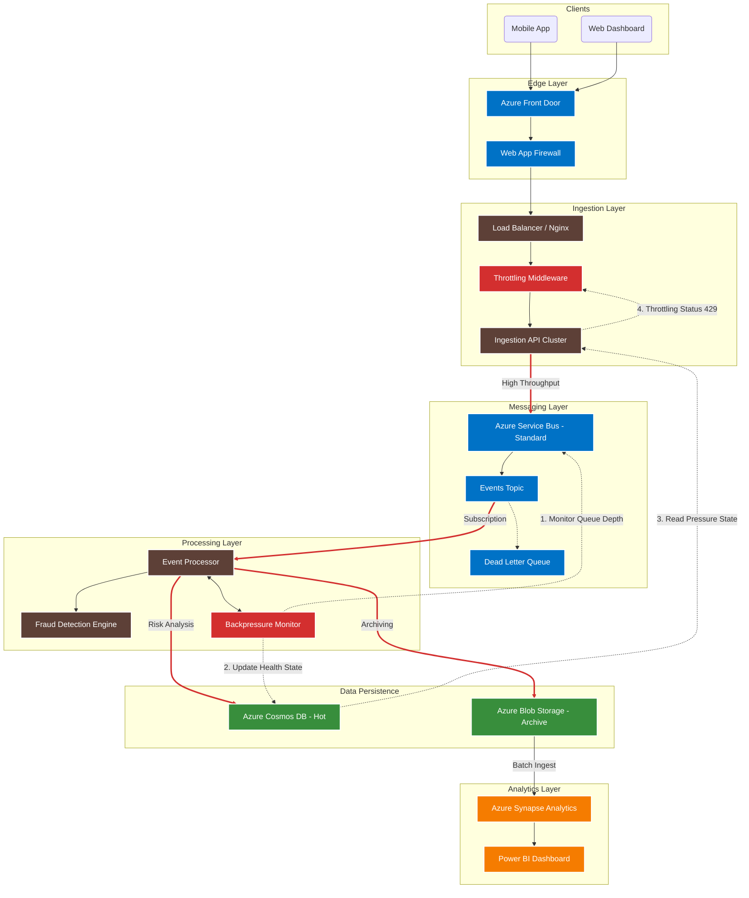

# CloudScale Event Intelligence Platform - System Architecture

## Mimari Bileşenler ve Akış

1.  **Edge Layer:** Kullanıcı trafiği **Azure Front Door** üzerinden gelir, **WAF** ile temizlenir.
2.  **Ingestion Layer:** İstekler **Load Balancer** ile dağıtılır. Eğer sistem "baskı altındaysa", **Throttling Middleware** istekleri reddeder (429).
3.  **Messaging Layer:** Kabul edilen olaylar **Service Bus Standard**'a fırlatılır. Hatalı mesajlar **DLQ**'ya düşer.
4.  **Processing Layer:** **Event Processor** mesajları işler, **Fraud Detection** yapar.
5.  **Monitor & Adjust (Geri Bildirim Döngüsü):** 
    *   `BackpressureMonitor` kuyruğu izler. Limit aşılırsa Cosmos DB'ye "Alarm" yazar.
    *   API bu alarmı görür ve Throttling'i aktif eder.
6.  **Storage & Analytics:** İşlenen veriler **Cosmos DB**'ye (Hot) ve **Blob Storage**'a (Cold) yazılır. **Synapse** soğuk veriyi analiz eder.
