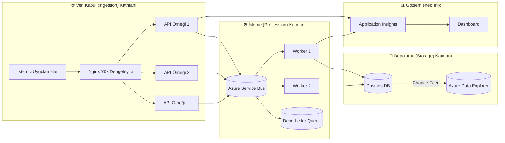

# ☁️ CloudScale Event Intelligence Platform - Proje Detayları

Bu doküman, mevcut projemiz olan **CloudScale Event Intelligence Platform**'un kapsamlı bir teknik özetini ve mimari detaylarını içermektedir.

---

## 🎯 Proje Misyonu ve Kimliği

**CloudScale Event Intelligence Platform**, saniyede binlerce kullanıcı olayını (clickstream, transactions, logs) işleyebilen, ölçeklenebilir ve yüksek erişilebilirlik (%99.9) sunan, Azure tabanlı, production-grade bir veri işleme sistemidir.

Projenin temel amacı, modern dağıtık sistemlerin karmaşıklığını "Principal-Level" mühendislik pratikleri ile yönetmektir. Sadece bir "demo" değil, gerçek dünya senaryolarındaki **idempotency (işlem tekrarı güvenliği)**, **latency (gecikme)**, **tutarlılık (consistency)** ve **güvenlik (security)** problemlerine çözüm getiren bir referans mimaridir.

---

## 🏗️ Mimari Genel Bakış

Aşağıdaki diyagram, sistemin veri akışını ve bileşenler arasındaki ilişkiyi görselleştirmektedir.

Ek olarak, detaylı bileşen ilişkileri şöyledir:

Sistem, "Event-Driven" (Olay Güdümlü) bir mimariye sahiptir ve **Azure-Native** servisler üzerine kurgulanmıştır.

### 1. Edge Layer (Uç Katman - Güvenlik & Dağıtım) 🛡️ [YENİ]
*   **Azure Front Door:** Küresel içerik dağıtımı ve yük dengeleme.
*   **Web Application Firewall (WAF):** OWASP saldırılarına karşı koruma ve IP filtreleme.

### 2. Ingestion Layer (Veri Kabul Katmanı)
Kullanıcıdan gelen trafiğin karşılandığı noktadır.
*   **Ingestion API (.NET 8 Minimal API):** Yüksek performanslı ve düşük gecikmeli (low-latency) veri kabul noktası.
*   **Security Context Fingerprinting:** İsteklerin güvenliğini sağlamak için IP, Cihaz Kimliği ve User-Agent üzerinden bir "ContextHash" üretilerek oturum çalma (session hijacking) girişimleri tespit edilir.
*   **Doğrulama:** FluentValidation kullanılarak veriler kuyruğa atılmadan önce senkron olarak doğrulanır.

### 3. Messaging & Async Processing (Mesajlaşma ve Asenkron İşleme)
Sistemin kalbini oluşturan, yük dengeleme ve güvenilirlik katmanıdır.
*   **Azure Service Bus:** Olayların kaybolmadan asenkron olarak taşınmasını sağlar. "Competing Consumers" ve "Pipes and Filters" desenlerini kullanır.
*   **Idempotency Stability (Kararlılık):**
    *   **Secure Deduplication:** `EventId` ve `PayloadHash` kontrolü ile aynı olayların (replay attack veya retry kaynaklı) mükerrer işlenmesi engellenir.
    *   **Collision Detection:** Aynı ID fakat farklı içerikle gelen istekler "Idempotency Collision" olarak işaretlenir ve reddedilir.
*   **Resilience (Dayanıklılık):** `Polly` kütüphanesi ile veritabanı kesintilerine karşı "Retry" ve "Circuit Breaker" mekanizmaları işletilir. Başarısız olaylar **Dead Letter Queue (DLQ)**'ya, hata metadata'sı ile birlikte gönderilir.

### 3. Intelligence & Risk Engine (Zeka ve Risk Motoru)
Verilerin işlendiği ve anlamlandırıldığı katmandır.
*   **Worker Service:** Arka planda çalışan .NET servisleri olayları işler.
*   **Fraud Detection (Sahtecilik Tespiti):**
    *   **Hız (Velocity) Kontrolü:** Belirli bir sürede anormal işlem sayısı.
    *   **Geo-Travel:** İmkansız seyahat senaryolarının tespiti.
    *   **Sigmoid Confidence Scoring:** Risk skorlaması, kullanıcının geçmişine göre dinamik olarak hesaplanır (yeni kullanıcılarda daha hassas).
*   **Temporal State Integrity:** Gecikmeli gelen (late arrival) olaylar işlendiğinde, geçmiş zaman dilimi için durum (state) yeniden hesaplanır ("re-hydration"), böylece veri tutarlılığı sağlanır.

### 5. Storage & Observability (Depolama ve Gözlemlenebilirlik)
*   **Azure Cosmos DB:** Olayların kalıcı olarak saklandığı "Hot Storage".
*   **Azure Blob Storage (Archive):** [YENİ] Maliyet optimizasyonu ve uzun süreli saklama için soğuk veri deposu (Cold Store).
*   **Strict Side-Effect Ordering:** Veri Cosmos DB'ye başarıyla yazılmadan hiçbir dış etki tetiklenmez.
*   **Read-Model Rehydration:** Veriler Cosmos DB Change Feed üzerinden okunarak Dashboard için optimize edilmiş farklı bir modele dönüştürülebilir.
*   **Gözlemlenebilirlik:** OpenTelemetry ve Application Insights ile distributed tracing (dağıtık izleme) ve metrik takibi yapılır.

---

## 🛠️ Teknoloji Yığını (Tech Stack)

### 1. Mimari Katmanlar
*   **Edge Layer:** Azure Front Door ve WAF ile global yük dengeleme ve güvenlik.
*   **Ingestion Layer:** .NET 10 Minimal API cluster, Nginx Load Balancer ve **Akıllı Daraltma (Throttling)**.
*   **Messaging Layer:** **Azure Service Bus (Standard Tier)** ile yüksek güvenilirliğe sahip asenkron mesajlaşma.
*   **Processing Layer:** Worker Pool, Dolandırıcılık Tespiti ve **Geri Bildirim Döngüsü (Adjust)**.
*   **Storage Layer:**
    *   **Hot Storage:** Azure Cosmos DB (NoSQL).
    *   **Cold Storage:** Azure Blob Storage (Archive).
*   **Analytics Layer:** **Azure Synapse Analytics** ve Azure Data Explorer ile derinlemesine analiz.
*   **Observability:** Application Insights ve Log Analytics ile tam izlenebilirlik.

### 2. Akıllı Geri Bildirim Döngüsü (Monitor & Adjust)

Sistem, Service Bus kuyruk derinliğini anlık olarak izler (**Monitor**). Kuyruk limitleri aşıldığında durum Cosmos DB üzerinden API katmanına sinyallenir ve API otomatik olarak istekleri daraltmaya (Throttling - 429) başlar (**Adjust**). Bu sayede sistem ağır yük altında çökmeden kendini korumaya alır.

---

## ✅ Doğrulanmış Yetenekler (Verified Capabilities)

Şu ana kadar yapılan testler ve doğrulamalar (Verification Suite) şunları kanıtlamıştır:
*   **[x] Near-Real-Time SLA:** API yanıt süreleri <1ms seviyesindedir (P99 hedefi <250ms).
*   **[x] Idempotency Protection:** Mükerrer ve manipüle edilmiş istekler başarıyla engellenmektedir.
*   **[x] Temporal Integrity:** Geç gelen veriler doğru işlenmekte ve tarihsel risk skorları güncellenmektedir.
*   **[x] Persistence-First Atomic:** Veri kaybı olmadan yan etkilerin yönetimi garanti altına alınmıştır.
*   **[x] Synthetic Watchdog:** "Bilinçli" sahte olaylar sisteme enjekte edilerek güvenlik konfigürasyonlarının doğruluğu sürekli denetlenmektedir.

---

## 🔮 Gelecek Planları

*   Azure Data Explorer veri hattının tam entegrasyonu.
*   Canary Deployment stratejilerinin uygulanması.
*   GDPR uyumlu veri silme mekanizmaları.

---

> _"Her mimari karar bir ödünleşimdir (trade-off). Kıdemli mühendisler sadece 'neyi' seçtiklerini değil, 'neden' seçtiklerini de açıklarlar."_
