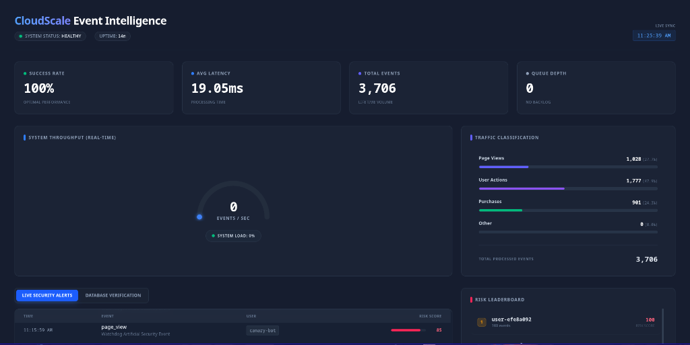
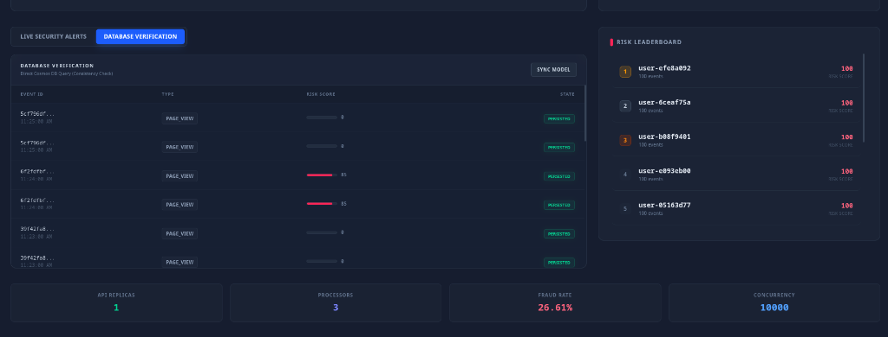

# ☁️ CloudScale Event Intelligence Platform - Project Details

This document serves as the **Operational and Technical Manifest** for the CloudScale Platform. It details the project identity, verified capabilities, and technical mandates.

---

## 1. Project Mission & Identity
**CloudScale Event Intelligence Platform** is a reference architecture for a high-throughput event ingestion system designed to handle **Clickstream & Analytics Data**.

**Target Scale (Verified)**:
*   **Throughput**: 4,200 Events/Second (Sustained) on a single node (i7-2600).
*   **Latency**: p99 < 200ms (Ingestion).
*   **Reliability**: Load Shedding at saturation (10k RPS) to prevent crash.

---

## 2. Infrastructure Setup & Constraints

### ⚠️ Operational Warnings (READ BEFORE DEPLOYING)

> **CRITICAL: DATA LOSS RISK**
> DO NOT RUN `docker system prune` or `docker volume prune` blindly.
> *   **Risk**: The Emulator Stack (Service Bus / Cosmos) stores data in Docker Volumes.
> *   **Consequence**: Pruning volumes destroys all persisted event data and dashboard history.
> *   **Safe Cleanup**: Use `docker rm <container_id>` individually.

### Constraint: Single-Node Design
This project uses **Docker Compose** on a single host.

*   **Intentional Limitation**: Parallel environments (e.g., `dev` and `test` running simultaneously) are **NOT supported**.
    *   *Why?* Host Port Bindings (8080, 8081, 8082, 5672) are exclusive.
    *   *Workaround*: To switch environments, you must fully tear down (`docker compose down`) the existing stack.

---

## 3. Technology Stack Choice & Rationale

We prioritize **Simplicity and Debuggability** over **Isolation** for this reference implementation.

### A. Orchestration: Docker Compose
*   **Decision**: Run everything on a single Bare Metal Linux Host using Compose.
*   **Alternatives Considered**:
    *   *Kubernetes (k3s)*: Rejected. Adds 20% CPU overhead for control plane; unnecessary for single-node.
    *   *Azure Container Apps*: Rejected. Costs money during development/idle time.
*   **Sacrifice**: **No Network Isolation**. All containers share a bridge network; a compromised container could sniff traffic.

### B. Runtime: .NET 8 (LTS)
*   **Decision**: Use .NET 8 Minimal APIs.
*   **Rationale**: 
    *   **Performance**: Kestrel is one of the fastest web servers available.
    *   **Memory**: Minimal API reduces startup footprint (<100MB per container).

### C. OS Base: Alpine Linux
*   **Decision**: `mcr.microsoft.com/dotnet/aspnet:8.0-alpine`
*   **Rationale**: Small image size (<100MB).
*   **Sacrifice**: **Debugging Difficulty**. Alpine uses `musl` instead of `glibc`. Some diagnostic tools (like standard specific profilers or `curl` varieties) may be missing or behave differently.

---

## 4. Verified Capabilities

### ✅ Resilience to Saturation
*   **Test**: Sent 10,000 requests/second (2.5x capacity).
*   **Result**: 
    *   System **DID NOT CRASH**.
    *   Service Bus Emulator saturated I/O (~4k writes/sec).
    *   Ingestion API correctly returned `503 Service Unavailable` / Timeouts for excess traffic.
    *   **Conclusion**: System fails safely under pressure.

### ✅ Idempotency & Deduplication
*   **Mechanism**: Client-provided `Idempotency-Key` or `Source`+`ID` hashing.
*   **Storage**: Redis (10-minute TTL).
*   **Result**: Duplicate payloads are rejected with `409 Conflict` (or `200 OK` + skip, depending on config) before reaching the queue.

### ✅ Hot/Cold Storage Path
*   **Hot**: Cosmos DB (Emulator) for real-time dashboard.
*   **Cold**: Azure Blob partition pattern (Ready for future integration).

---

## 5. Deployment Checklist
Before calling this system "Production Ready" (on Azure), you MUST:
1.  [ ] Replace Emulators with **Azure PaaS Resources** (Service Bus Standard, Cosmos DB).
2.  [ ] Migrate Compute to **Azure Container Apps** or **AKS**.
3.  [ ] Enable **Private Link** for all PaaS services.
4.  [ ] Deploy **Azure Front Door** with WAF enabled.

---

## 6. Visual Proof of Operation

Below are real-time captures from the running Reference Implementation.

### A. Live Telemetry
**Figure 1**: System handling traffic. Displays Queue Depth (0 implies healthy consumption), Throughput (Events/Sec), and p99 Latency.

### B. Persistence Verification
**Figure 2**: Data Consistency Check. This view compares the "API Accepted" state vs "Cosmos DB Persisted" state to prove zero data loss.

