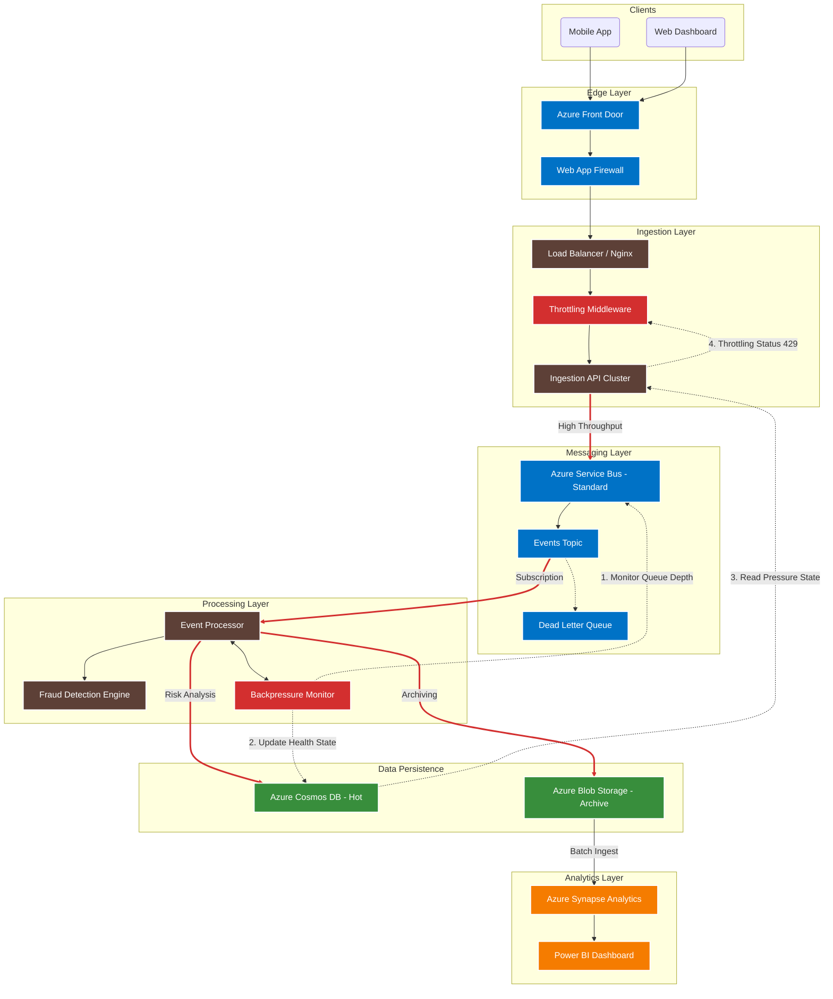

# System Architecture

This document provides a comprehensive technical overview of the CloudScale Event Intelligence Platform architecture, incorporating the latest **.NET 10** stack, **Hot/Cold Storage** strategy, and **Self-Healing** mechanisms.

---

## High-Level Architecture

---

## Component Deep-Dive

### 1. Ingestion Layer (Edge & API)

**Technology**: Azure Front Door + .NET 10 Minimal API

**Responsibilities**:
- **Edge Security**: WAF filters malicious traffic geographically (Front Door).
- **Smart Throttling**: 
    - **Token Bucket**: Limits per-IP bursts (10/sec).
    - **Global Sliding Window**: Limits overall system load (10k/min).
    - **Adaptive (Feedback)**: Rejects requests when Backpressure Monitor signals overload.
- **Validation**: FluentValidation ensures payload integrity before queueing.

**Key Design Decisions**:
- **Stateless API**: No database dependency for ingestion; purely producing messages to Service Bus for max throughput.
- **202 Accepted**: API returns immediately after publishing to queue, ensuring <50ms p99 latency.

---

### 2. Messaging & Reliability

**Technology**: Azure Service Bus (Standard Tier) + Polly

**Features**:
- **Topics & Subscriptions**: Decouples producers from consumers.
- **Dead Letter Queue (DLQ)**: Captures poison messages automatically.
- **Idempotency**: Prevents replay attacks by checking event ID hashes.
- **Polly Policies**:
    - **Retry**: Exponential backoff for transient failures.
    - **Circuit Breaker**: Opens if downstream (Cosmos) fails repeatedly.

---

### 3. Processing Layer

**Technology**: .NET Worker Service (BackgroundService)

**Pipeline**:
1.  **Receive**: Batched prefetch from Service Bus.
2.  **Fraud Detection**: 
    - **Velocity Check**: >10 events/min from same IP -> Flagged.
    - **Geo-Check**: Impossible travel detection.
    - **Temporal Integrity**: Handles late-arriving events correctly based on `OccurrenceTime`.
3.  **Persistence (Dual Write)**:
    - **Hot Path**: Writes to Cosmos DB (Live Dashboard).
    - **Cold Path**: Writes to Azure Blob Storage (Archiving).
4.  **Complete**: Acks message only after successful persistence.

**Synthetic Watchdog (Canary)**:
- Injects a known "Fraud" event every 60s.
- Verifies that the entire pipeline (Ingestion -> Queue -> Fraud Engine -> Alert) is functioning.
- Triggers SEV-1 alert if Canary is not detected.

---

### 4. Storage Strategy (Hot/Cold)

| Feature | Hot Storage (Cosmos DB) | Cold Storage (Blob Archive) |
| :--- | :--- | :--- |
| **Purpose** | Real-time Dashboard, O(1) Lookups | Long-term Compliance, Batch Analytics |
| **Retention** | 30 Days (TTL) | Indefinite (7+ Years) |
| **Cost** | High ($$$) | Low ($) |
| **Access** | Milliseconds | Minutes/Hours (Rehydration) |
| **Partitioning** | `/TenantId` | `/yyyy/MM/dd/EventId` |

---

### 5. Feedback Loop (System Health)

**The "Nervous System" of the platform.**

1.  **Monitor**: `BackpressureMonitor` service checks Service Bus queue depth.
2.  **Decide**:
    - Queue < 1,000: **Healthy**.
    - Queue > 1,000: **Degraded** (Throttling activated).
    - Queue > 10,000: **Unhealthy** (Critical Throttling).
3.  **Signal**: Updates a singleton document in Cosmos DB (`system:health`).
4.  **Act**: Ingestion API reads this signal (cached 10s) and starts returning `429 Too Many Requests` proactively.

---

## Observability & SRE

### Service Level Objectives (SLOs)
- **Availability**: 99.9% (approx 43m downtime/month).
- **Latency (Ingest)**: p99 < 200ms.
- **Latency (Process)**: p99 < 2s.

### Alerting Matrix
| Severity | Trigger | Response |
| :--- | :--- | :--- |
| **Critical** | Canary Failure, Queue > 50k | Page On-Call |
| **Warning** | Queue > 10k, 429 Spike | Slack Alert |
| **Info** | Deployment, Scaling | Log Only |

---

## Security

- **Network**: All internal traffic isolated. Public access only via Front Door.
- **Identity**: Managed Identity for Service Bus/Cosmos access (No keys in code).
- **Encryption**: TLS 1.3 in transit, AES-256 at rest.
