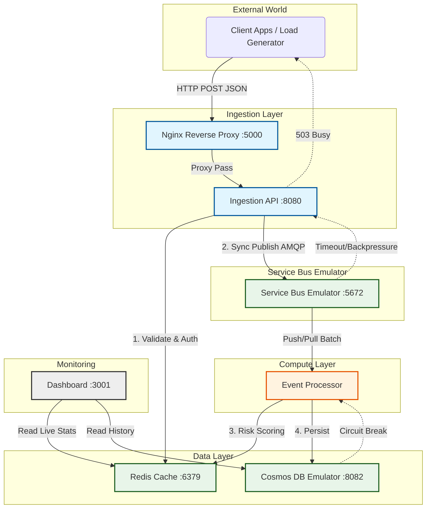

# System Architecture

This document provides a **Principal-level technical overview** of the CloudScale Event Intelligence Platform. It details the logical architecture, physical deployment limitations, component interactions, and failure propagation models.

> **⚠️ Scope Warning**
> This architecture describes the **Single-Node Emulator Environment** (Dev/Reference).
> **Explicit Non-Goals** for this specific deployment include:
> *   **High Availability (HA)**: Single point of failure (i7-2600 Host).
> *   **Data Durability > 99.9%**: No RAID/Redundancy. Data lives on single disk.
> *   **Geo-Redundancy**: No region replication.

---

## 1. Logical Architecture & Data Flow

---

## 2. Infrastructure Constraints & Decisions

### 2.1 Single-Node Docker Compose (The "Emulator Stack")
We utilize a **containerized emulator stack** to simulate Azure PaaS services on x86_64 hardware. This decision favors **cost-efficiency and developer velocity** over production fidelity.

*   **Service Bus Emulator**: Simulates Azure Service Bus Standard.
    *   *Limit*: Theoretical I/O cap ~4,000 msg/sec (observed).
    *   *Difference*: No real partitioning, purely memory/disk bound.
*   **Cosmos DB Emulator**: Simulates Azure Cosmos DB SQL API.
    *   *Limit*: Single-partition.
    *   *CAP Theorem*: **CP** (Consistency/Partition Tolerance) is theoretical here; essentially a local document store.

### 2.2 Network Architecture & The "Port 8081" Incident
A critical architectural constraint is the **Host Port Binding**.

*   **Problem**: `Cosmos DB Emulator` listens on port `8081`. On many Linux hosts, `8081` is often claimed by internal processes (McAfee, Java Agents) or zombie Docker bindings (`ipvlan`).
*   **Root Cause**: Non-deterministic port binding race conditions during `docker compose up`.
*   **Resolution**: We explicitly bind Cosmos DB to **Host Port 8082** (`8082:8081`).
    *   *Internal Traffic*: Containers talk to `cosmosdb-emulator:8081` (Docker DNS).
    *   *External/Dashboard*: Host talks to `localhost:8082`.

### 2.3 Nginx Role (Reverse Proxy vs Gateway)
The `nginx` container exposed on port `:5000` is a **Reverse Proxy**, NOT a full API Gateway.

*   **What it does**: Port consolidation (routes `/api` to Ingestion, `/dashboard` to UI).
*   **What it DOES NOT do**:
    *   **No WAF**: No SQLi/XSS filtering.
    *   **No Rate Limiting**: The platform relies on Application-layer limitation (ASP.NET Core RateLimiting).
    *   **No TLS Termination**: Traffic is plain HTTP inside the host.

---

## 3. Failure Propagation & Resilience

### 3.1 Failure Mode: "The Service Bus Bottleneck"
If the **Service Bus Emulator** reaches its I/O limit (approx 4k RPS):
1.  **Ingestion API** operations (`SendAsync`) start timing out (>10s).
2.  **Backpressure** builds up in Kestrel thread pool.
3.  **Client Response**: The API returns `503 Service Unavailable` or simply drops the connection (ClientConnectorError).
    *   *Intent*: Load shedding to protect the compute node from OOM.

### 3.2 Failure Mode: "Cosmos DB Outage"
If **Cosmos DB Emulator** fails (e.g. "Created" state zombie):
1.  **Event Processor** cannot persist data.
2.  **Circuit Breaker (Polly)** opens.
3.  **Processor** stops acknowledging messages to Service Bus.
4.  **Service Bus** queue depth increases immediately.
5.  **Dashboard** shows "Zero Processed Events" but "High Queue Depth".

---

## 4. Operational Boundaries

| Component | Standard | Boundary / Limit | Behavior at Limit |
| :--- | :--- | :--- | :--- |
| **Ingestion** | Synchronous | ~4,200 RPS | Timeouts / 5xx Errors |
| **Compute** | Single Core | 100% CPU | Latency spikes (p99 > 5s) |
| **Monitoring** | Real-time | < 1s Lag | Lag increases linearly with Load |

> **Principal Note**: This architecture is designed for **correctness verification**, not maximum throughput. For production loads >10k RPS, the "Emulator Stack" must be replaced with **Azure PaaS (Tier 1/Standard)** resources and the Compute layer moved to **Kubernetes (AKS)** for horizontal scaling.
