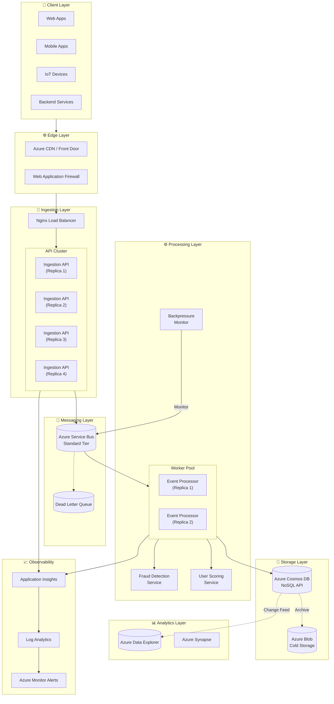
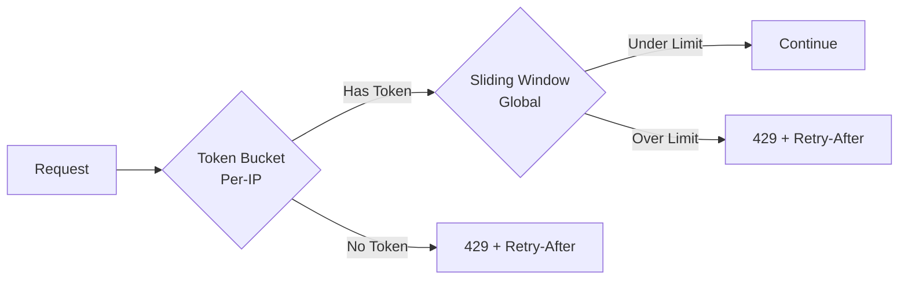
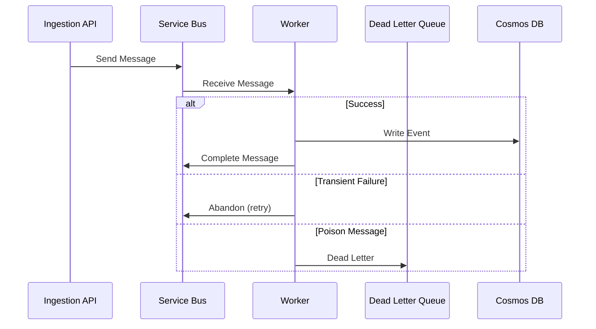
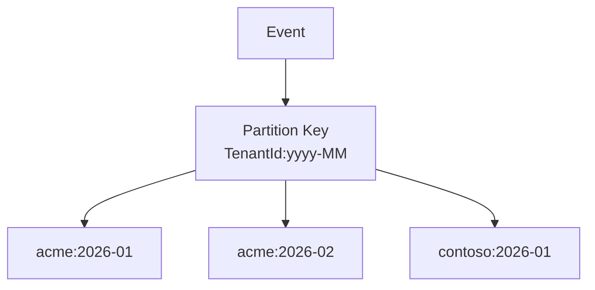
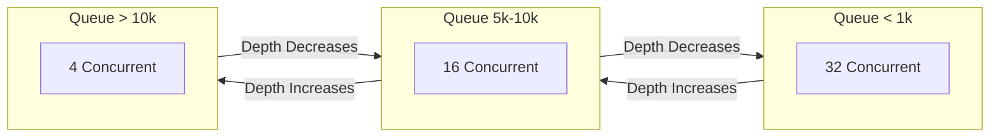
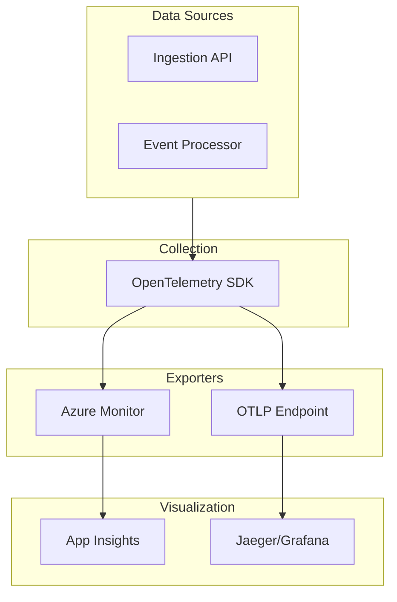

# System Architecture


This document provides a comprehensive technical overview of the CloudScale Event Intelligence Platform architecture.

---

## High-Level Architecture



---

## Component Deep-Dive

### 1. Ingestion API

**Technology**: .NET 8 Minimal API

**Responsibilities**:
- Accept HTTP POST requests with event payloads
- Validate event structure (FluentValidation)
- Apply rate limiting (Token Bucket + Sliding Window)
- Enrich events with metadata (timestamp, IP, correlation ID)
- Publish to Service Bus asynchronously

**Key Design Decisions**:
```
┌─────────────────────────────────────────────────────────────┐
│ Request Flow                                                │
├─────────────────────────────────────────────────────────────┤
│ HTTP Request                                                │
│     ↓                                                       │
│ RateLimitingMiddleware (429 if exceeded)                   │
│     ↓                                                       │
│ CorrelationIdMiddleware (inject/forward X-Correlation-Id)  │
│     ↓                                                       │
│ FluentValidation (400 if invalid)                          │
│     ↓                                                       │
│ EventEnrichmentService (add metadata)                       │
│     ↓                                                       │
│ ServiceBusProducer (async publish with Polly retry)        │
│     ↓                                                       │
│ 202 Accepted                                                │
└─────────────────────────────────────────────────────────────┘
```

**Scaling**: 4 replicas behind Nginx, stateless, horizontal scaling via `docker compose --scale`

---

### 2. Rate Limiting

**Algorithm**: Dual-layer protection



| Layer | Algorithm | Limit | Purpose |
|-------|-----------|-------|---------|
| Per-IP | Token Bucket | 100 tokens, 10/sec refill | Prevent single-source abuse |
| Global | Sliding Window | 10k/minute | Prevent system overload |

**Why Both?**
- Token Bucket allows legitimate bursts (batch uploads)
- Sliding Window provides global protection
- Defense in depth

---

### 3. Azure Service Bus

**Configuration**:
```
Tier: Standard (Premium for production)
Queue: events-ingestion
Max Size: 5 GB
Message TTL: 14 days
Lock Duration: 5 minutes
Max Delivery Count: 10
```

**Message Flow**:


**Dead Letter Reasons**:
- `MissingEventType` - No event type specified
- `DeserializationFailed` - Invalid JSON
- `UnknownEventType` - Unrecognized event type
- `MaxRetriesExceeded` - Failed after 5 attempts

---

### 4. Event Processor

**Technology**: .NET Worker Service (BackgroundService)

**Processing Pipeline**:
```
Message Received
     ↓
Deserialize by EventType (page_view, purchase, etc.)
     ↓
Fraud Detection (velocity check)
     ↓
User Scoring (behavioral analysis)
     ↓
Cosmos DB Write (with Polly retry)
     ↓
Scheduled Actions (cart abandonment check)
     ↓
Complete Message
```

**Concurrency Control**:
```csharp
MaxConcurrentCalls = 32  // Configurable
PrefetchCount = 100      // Batch optimization
AutoCompleteMessages = false  // Manual ack
```

---

### 5. Cosmos DB

**Configuration**:
```
API: NoSQL (Core)
Consistency: Session (default)
Partition Key: /{TenantId}:{yyyy-MM}
TTL: 30 days (2,592,000 seconds)
RU/s: Autoscale 400-4000
```

**Partition Strategy**:


**Why This Strategy?**
1. **Tenant Isolation**: Queries by tenant hit single partition
2. **Time Distribution**: Prevents hot partitions
3. **TTL Alignment**: Old partitions naturally expire
4. **Query Patterns**: Most queries filter by tenant + time range

---

### 6. Backpressure Handling

**Thresholds**:


**Monitoring**:
- `BackpressureMonitor` checks queue depth every 30 seconds
- Emits `cloudscale_queue_depth` metric
- Alerts at 5k (warning) and 10k (critical)

---

### 7. Observability Stack



**Custom Metrics**:
| Metric | Type | Labels |
|--------|------|--------|
| `cloudscale_events_ingested_total` | Counter | event_type, tenant_id |
| `cloudscale_ingestion_duration_seconds` | Histogram | event_type |
| `cloudscale_fraud_detected_total` | Counter | event_type |
| `cloudscale_queue_depth` | Gauge | - |
| `cloudscale_rate_limit_rejections_total` | Counter | - |

---

## Data Flow Scenarios

### Scenario 1: Normal Event Ingestion

```
1. Client → POST /api/events
2. Nginx → Round-robin to API replica
3. API → Validate → Enrich → Publish to SB (async)
4. API → Return 202 Accepted (< 50ms)
5. Worker → Receive → Process → Write to Cosmos
6. Worker → Complete message
```

### Scenario 2: Traffic Spike (10x Load)

```
1. Rate limiter rejects excess requests (429)
2. Service Bus buffers accepted events (up to 5GB)
3. BackpressureMonitor detects queue growth
4. Concurrency reduced (32 → 16 → 4)
5. Processing slows gracefully
6. Queue drains over time
7. Concurrency restored
```

### Scenario 3: Poison Message

```
1. Worker receives malformed message
2. Deserialization fails
3. Message dead-lettered with reason
4. DLQ alert fires
5. Operator investigates
6. Fix and reprocess or discard
```

---

## Security Considerations

| Layer | Protection |
|-------|------------|
| Network | Azure NSG, Private Endpoints |
| Authentication | Managed Identity (no secrets in code) |
| Secrets | Azure Key Vault |
| Transport | TLS 1.3 |
| API | Rate limiting, input validation |
| Data | Encryption at rest (Cosmos), TTL |

---

## Failure Modes & Mitigations

| Failure | Impact | Mitigation |
|---------|--------|------------|
| API replica down | Reduced capacity | Nginx health checks, auto-restart |
| Service Bus throttle | Message delays | Backpressure monitoring, queue alerts |
| Cosmos DB 429 | Write failures | Polly retry with RetryAfter |
| Worker crash | Message redelivery | Auto-restart, lock renewal |
| Full DLQ | Data loss risk | Alert at >0 messages, capacity monitoring |
