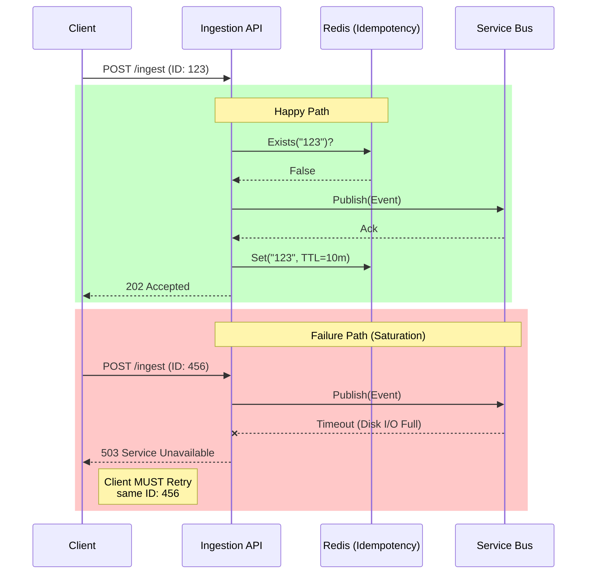

# System Integration Guide

This guide details how external clients (Mobile Apps, Web Frontends, Third-Party Systems) should integrate with the CloudScale Ingestion API.

> **Protocol**: HTTP/1.1 REST
> **Format**: JSON (CloudEvents v1.0 Spec)
> **Auth**: API Key (Header: `X-Api-Key`)

---

## 1. Event Payload Schema

We strictly adhere to the **CloudEvents v1.0** specification. Clients MUST send valid CloudEvents.

### 1.1 JSON Structure
```json
{
  "specversion": "1.0",
  "type": "com.cloudscale.pageview",
  "source": "/mobile/ios/v2.1",
  "id": "a1b2c3d4-e5f6-7890",
  "time": "2026-01-28T10:00:00Z",
  "datacontenttype": "application/json",
  "data": {
    "userId": "user_123",
    "pageUrl": "/checkout",
    "meta": {
        "device": "iPhone 13"
    }
  }
}
```

### 1.2 Field Definitions
| Field | Requirement | Description |
| :--- | :--- | :--- |
| `specversion` | **Mandatory** | Must be `1.0`. |
| `type` | **Mandatory** | Classification (e.g., `com.cloudscale.pageview`, `com.cloudscale.transaction`). |
| `source` | **Mandatory** | URI identifying the producer (used for Risk Scoring). |
| `id` | **Mandatory** | **Unique UUID**. Used for **Idempotency**. |
| `data` | Optional | The actual business payload. |

---

## 2. Idempotency & Retries

**The Principle of Exactly-Once Processing starts with the Client.**

1.  **Unique ID**: The Client MUST generate a generic UUID for the `id` field.
2.  **Retry Logic**: If the API returns `5xx` or `429`, the Client MUST retry the **same payload** with the **same ID**.
3.  **Server Behavior**:
    *   If `id` is new: Process and return `202 Accepted`.
    *   If `id` exists in cache (10m): Return `202 Accepted` (or `409` if configured) and **discard** the duplicate.
    *   **Result**: Safe to retry indefinitely.

### 2.1 Protocol Flow (Sequence)



---

## 3. Response Codes

| Status | Meaning | Client Action |
| :--- | :--- | :--- |
| **202 Accepted** | Event queued. Not yet persisted. | **Success**. Do not retry. |
| **400 Bad Request** | Invalid Schema / Validation Fail. | **Fix Logic**. Do not retry. |
| **401 Unauthorized** | Missing/Invalid API Key. | **Fix Config**. |
| **429 Too Many Requests** | Global/IP Rate Limit Hit. | **Backoff**. Retry after `Retry-After` header. |
| **503 Service Unavailable** | Queue Full / System Saturation. | **Backoff**. Retry exponentially (max 5s). |

---

## 4. Endpoints

### Production (Load Balanced)
`POST https://api.cloudscale.com/ingest`

### Local Emulator (Nginx Proxy)
`POST http://192.168.0.10:5000/api/ingest`
