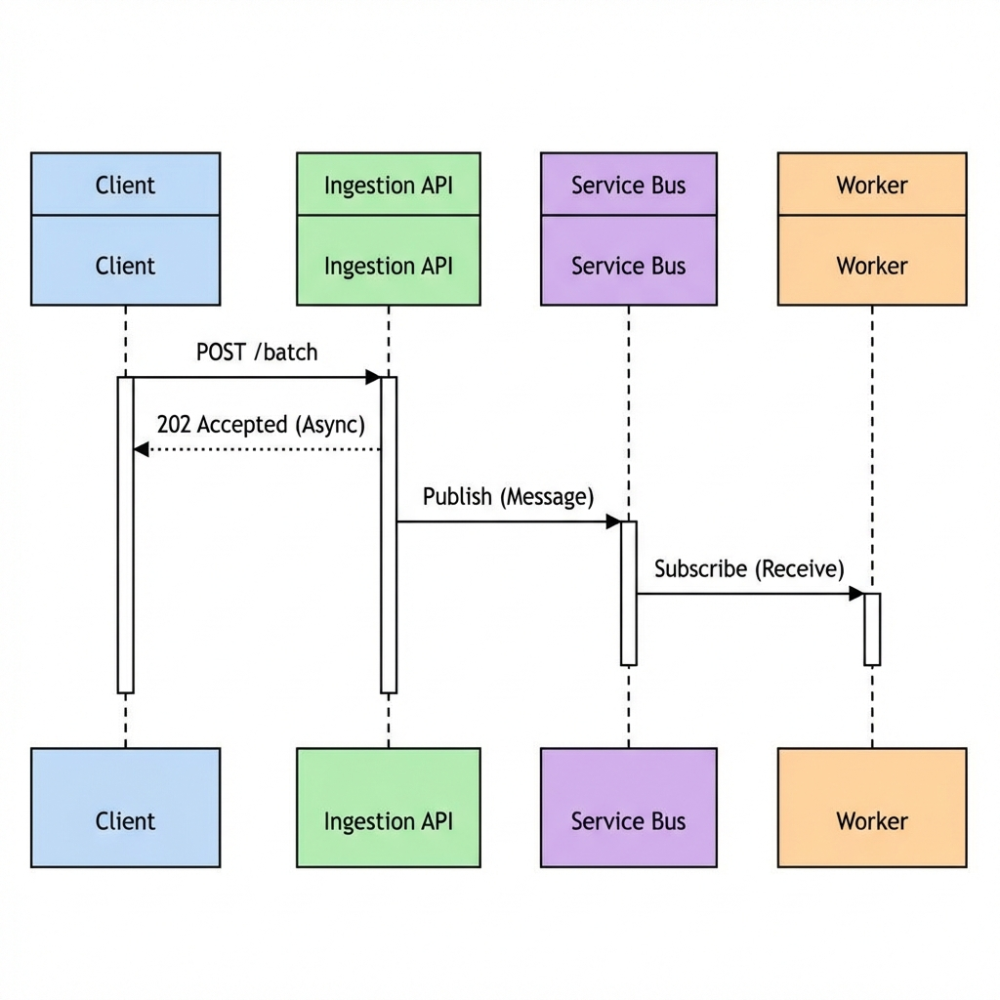

# CloudScale Integration Guide



This guide explains how to configure your own frontend and backend systems to integrate with the CloudScale Event Intelligence Platform.

## 1. Backend Configuration (API & Processor)

The backend components (Ingestion API and Event Processor) are configured via `appsettings.json` or Environment Variables.

### Connection Strings
You must provide connection details for Azure Service Bus and Cosmos DB.

**Environment Variables (Recommended for Docker):**
- `ServiceBus__ConnectionString`: Full connection string (e.g., `Endpoint=sb://...;SharedAccessKey...`)
- `ServiceBus__QueueName`: Name of the ingestion queue (default: `events-ingestion`)
- `CosmosDb__Endpoint`: Your Cosmos DB URI (e.g., `https://my-cosmos.documents.azure.com:443/`)
- `CosmosDb__AccountKey`: Primary/Secondary key for authentication
- `CosmosDb__DatabaseName`: Database name (default: `EventsDb`)

### Platform Limits
- `Kestrel__Limits__MaxConcurrentConnections`: Sets the `Max Concurrent` metric displayed on the dashboard.
- `RateLimiting__TokensPerSecond`: Controls the API firewall capacity.

---

## 2. Frontend Configuration (Dashboard)

The React dashboard needs to know where to find the Ingestion API to fetch its telemetry data.

**Environment Variable:**
- `VITE_API_URL`: The full URL to the `/api/dashboard` endpoint of your Ingestion API.
  *   *Example:* `http://your-api-domain.com/api/dashboard`

---

## 3. Integrating Your Data (Event Types)

To see data on the dashboard, your applications must send events to the `/api/events` endpoint of the Ingestion API.

### Required Base Fields for All Events
```json
{
  "eventId": "uuid-string",
  "eventType": "one_of_the_types_below",
  "correlationId": "tracking-id",
  "tenantId": "your-org-id",
  "userId": "user-123",
  "createdAt": "2024-01-27T12:00:00Z"
}
```

### Specific Event Payloads
Our system is pre-configured to recognize and categorize these types:

| Event Type | Additional Required Fields | Dashboard Placement |
| :--- | :--- | :--- |
| `page_view` | `"url": "/path"` | Event Distribution |
| `user_action` | `"actionName": "click"` | Event Distribution |
| `purchase` | `"actionName": "sale", "amount": 99.99` | Event Distribution |
| `check_cart_status`| Base fields only | Event Distribution |

---

## 4. Deployment Check-list
1.  **Service Bus**: Ensure the queue specified in `ServiceBus__QueueName` exists.
2.  **Cosmos DB**: The system will attempt to auto-initialize the database/container if it doesn't exist.
3.  **CORS**: Ensure `VITE_API_URL` is allowed in the API's CORS policy (configured in `Program.cs`).
