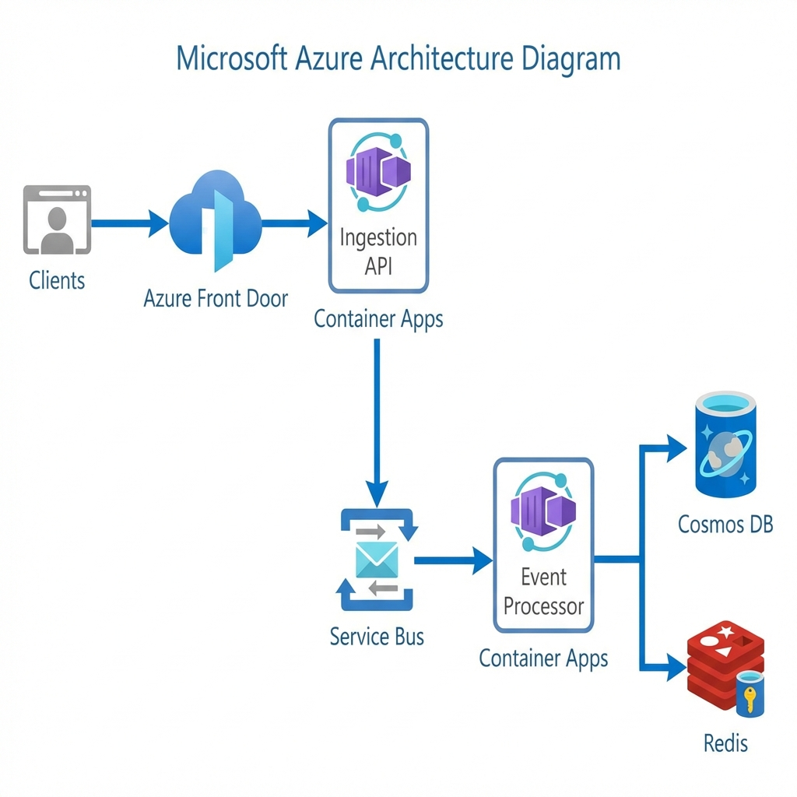
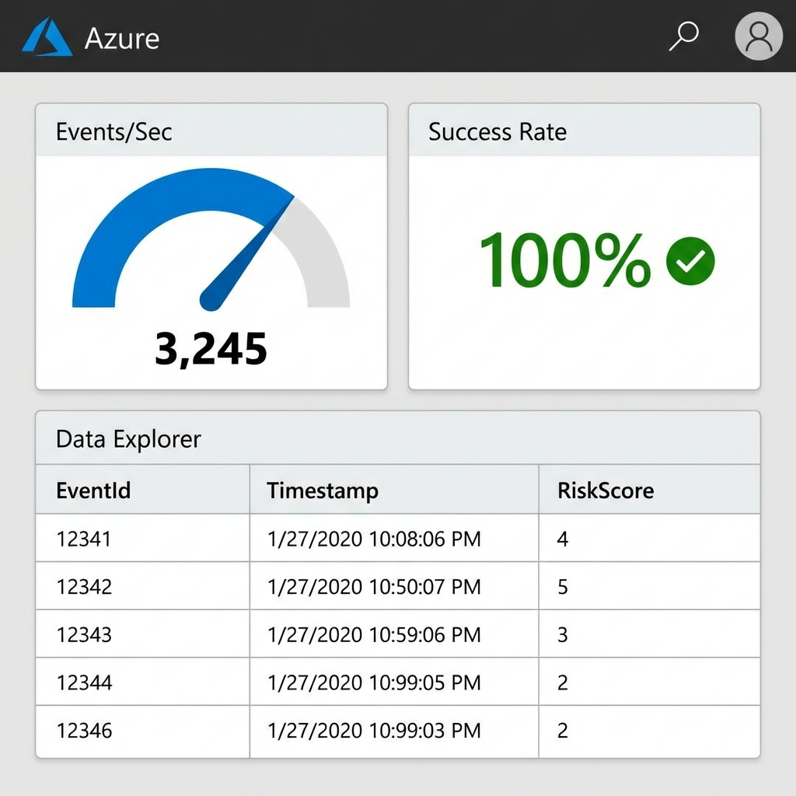

# Microsoft System Design Interview - Defense Cheat Sheet

## Portfolio Snapshots
| Architecture | Dashboard |
|:---:|:---:|
|  |  |

This document prepares you for common Microsoft system design interview questions about the CloudScale Event Intelligence Platform.

---

## Q1: "What happens at 10x load?"

**Answer:**
1. **Rate Limiting kicks in** - Token bucket (100 tokens/IP) and sliding window (10k/min global) reject excess traffic with 429 + Retry-After header
2. **Backpressure monitoring** - `BackpressureMonitor` detects queue depth > 5k, reduces processor concurrency from 32 → 16 → 4
3. **Service Bus absorbs spike** - Premium tier can buffer millions of messages
4. **Cosmos DB 429 handling** - Polly retry with exponential backoff + RetryAfter header respect
5. **Horizontal scaling** - Container Apps KEDA trigger spawns more processor instances

**Key point**: We fail gracefully with clear signals (429s) rather than falling over.

---

## Q2: "How do you handle poison messages?"

**Answer:**
1. **Delivery count tracking** - Service Bus tracks attempts automatically
2. **Structured error handling in `EventProcessorWorker`**:
   - Missing EventType → DLQ with "MissingEventType"
   - Deserialization failure → DLQ with "DeserializationFailed"  
   - Unknown event type → DLQ with "UnknownEventType"
   - Max retries exceeded (>5) → DLQ with "MaxRetriesExceeded"
3. **DLQ monitoring** - Alert when DLQ depth > 0
4. **Manual remediation** - Reprocess or discard after analysis

**Code reference**: `EventProcessorWorker.cs` lines 116-147

---

## Q3: "Why not use Azure Functions?"

**Answer:**
| Concern | Azure Functions | Our Approach (Worker Service) |
|---------|-----------------|-------------------------------|
| Cold start | 1-10+ seconds | Always warm |
| Execution limit | 10 min default | Unlimited |
| Concurrency control | Limited | Full Polly control |
| State management | Stateless complexity | In-memory cache for fraud detection |
| Cost at scale | Can explode | Predictable Container Apps pricing |

**When Functions ARE right**: 
- Sporadic, bursty workloads
- Simple transformations
- Consumption-based cost model preferred

---

## Q4: "How do you ensure exactly-once processing?"

**Answer:**
We use **at-least-once with idempotency**:

1. **Idempotent writes** - EventId is the Cosmos DB document `id`
2. **Conflict handling** - 409 Conflict treated as success (duplicate)
3. **Message completion** - Only `CompleteMessageAsync` after successful DB write
4. **Dead lettering** - Poison messages don't block retry loop

**Why not exactly-once?**
- Distributed systems can't guarantee exactly-once without 2PC
- 2PC adds latency and complexity
- At-least-once + idempotency achieves same effect practically

---

## Q5: "Explain your partition key strategy"

**Answer:**
```
PartitionKey = "{TenantId}:{yyyy-MM}"
```

**Rationale**:
1. **Tenant isolation** - Queries scoped to tenant are single-partition
2. **Time distribution** - Monthly suffix prevents hot partitions
3. **TTL alignment** - Expired partitions can be cleaned efficiently
4. **Query patterns** - Most queries filter by tenant + time range

**Trade-offs**:
- Cross-tenant queries require fan-out (acceptable for admin dashboards)
- Cross-month queries for single tenant require 2-partition reads

---

## Q6: "How do you handle multi-region?"

**Answer:**
**Current**: Single-region (designed for multi-region)

**Migration path**:
1. Cosmos DB: Enable multi-region writes
2. Service Bus: Premium tier with geo-DR
3. Container Apps: Deploy to multiple regions
4. Traffic Manager: Route by latency

**Consistency considerations**:
- Session consistency works across regions
- Conflict resolution: Last-write-wins (default) or custom resolver

---

## Q7: "What's your testing strategy?"

**Answer:**
| Layer | Tool | Coverage |
|-------|------|----------|
| Unit | xUnit + Moq | FraudDetectionService, UserScoringService |
| Integration | Testcontainers | Cosmos Emulator, Service Bus Emulator |
| Load | Python aiohttp scripts | 10k RPS sustained |
| Chaos | Manual injection | Network partitions, Cosmos 429s |

**Key tests**:
- `FraudDetectionServiceTests.cs` - Velocity limit validation
- `load_test_stable.py` - Throughput baseline
- `verify_data_integrity.py` - End-to-end event persistence

---

## Q8: "What metrics do you track?"

**Answer:**
| Metric | Type | Purpose |
|--------|------|---------|
| `cloudscale_events_ingested_total` | Counter | Throughput |
| `cloudscale_ingestion_duration_seconds` | Histogram | SLI for latency |
| `cloudscale_fraud_detected_total` | Counter | Security monitoring |
| `cloudscale_rate_limit_rejections_total` | Counter | Capacity planning |
| `cloudscale_queue_depth` | Gauge | Backpressure detection |

**SLOs**:
- 99.9% availability (43 min/month downtime budget)
- p99 ingestion latency < 200ms
- p99 processing latency < 2s

---

## Q9: "What would you do differently?"

**Honest self-critique**:
1. **Observability first** - Should have added OpenTelemetry from day 1
2. **Schema registry** - Event schema evolution could use formal versioning
3. **Feature flags** - Would help with progressive rollout
4. **Synthetic monitoring** - Continuous prod validation

---

## Q10: "How does this compare to Kafka?"

**Answer:**
| Aspect | Our Service Bus Approach | Kafka Alternative |
|--------|--------------------------|-------------------|
| Managed | Fully managed | Self-managed or Confluent |
| Ordering | Per-session | Per-partition |
| Retention | 14 days | Infinite (disk) |
| Replay | Manual from DLQ | Native log replay |
| Cost | Per-message | Per-broker |

**When Kafka is better**:
- Need infinite retention / log replay
- Already have Kafka expertise
- Event sourcing architecture
- Extremely high throughput (>1M msg/sec)
