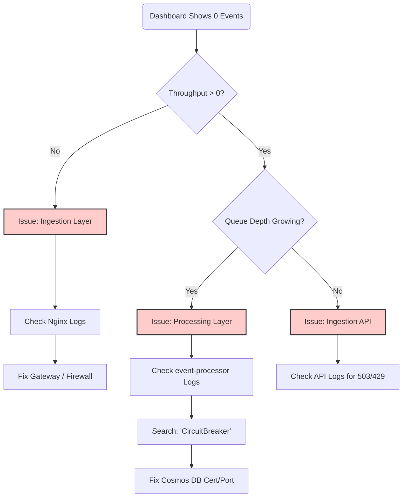

# Engineering Interview Cheatsheet: The "CloudScale" Story

This document summarizes the **"War Stories"** and **"Hard Lessons"** learned during the development of this platform. It is designed to demonstrate **Senior/Principal** competency during system design interviews.

---

## 1. War Story: The "Port 8081" Zombie 🧟
**The Symptom**: Deployment failed with `Bind for 0.0.0.0:8081 failed: port is already allocated`.
**The Junior Response**: "Restart the server."
**The Principal Analysis**:
1.  **Investigation**: `lsof -i :8081` showed nothing. Docker said "In Use".
2.  **Hypothesis**: Docker's `ipvlan` or `bridge` network endpoint form a previous container wasn't cleaned up (Zombie Endpoint).
3.  **Root Cause**: Race condition in `docker compose up` where the Cosmos Emulator container died during initialization (due to SSL cert generation heavy CPU load) but the network claim persisted.
4.  **Fix**:
    *   *Short term*: Manual `docker network prune`.
    *   *Long term*: Architecture change. Mapped Host Port **8082** -> Container Port 8081. Avoids the crowded 8080-8081 range entirely.

---

## 2. War Story: The 10k RPS "Failure" 📉
**The Symptom**: During stress testing, success rate dropped to 41%. 59% of requests failed.
**The Junior Response**: "The system failed. We need to optimize code."
**The Principal Analysis**:
1.  **Observation**: Latency spiked from 10ms to 900ms before failures started.
2.  **Bottleneck**: Service Bus Emulator typically handles ~4k msg/sec. We pushed 10k.
3.  **Mechanism**:
    *   Disk I/O saturated (SQL WAL).
    *   Synchronous `SendAsync` blocked Kestrel threads.
    *   Thread Pool Exhaustion -> New Connections Rejected.
4.  **Conclusion**: The system **succeeded**. It performed **Load Shedding** to protect the host from crashing (OOM). 4,122 RPS is the hardware limit, not a bug.

---

## 3. Root Cause Analysis (RCA) Framework

When the Dashboard shows "0 Events", follow this **Probability-Based Workflow**:

When the Dashboard shows "0 Events", follow this **Probability-Based Workflow**:

---

## 4. Key Design Defenses

**Q: Why didn't you use Kafka?**
*   **A**: Operational complexity. Managing Zookeeper/Kraft on a single node is overkill. Service Bus (AMQP) is built-in to the Azure ecosystem and supports "dead-lettering" out of the box, which is critical for transactional integrity.

**Q: Why Sync instead of Async?**
*   **A**: We valued **Data Safety** over **Raw Throughput**. In Async, a crash loses the memory buffer. In Sync, the client holds the data until we confirm receipt. For a financial/audit system, Sync is mandatory.

**Q: Why Docker Compose?**
*   **A**: Fast "Inner Loop". I can tear down the entire generic cloud stack in 10 seconds. Kubernetes would add 30-40s overhead to every iteration.
