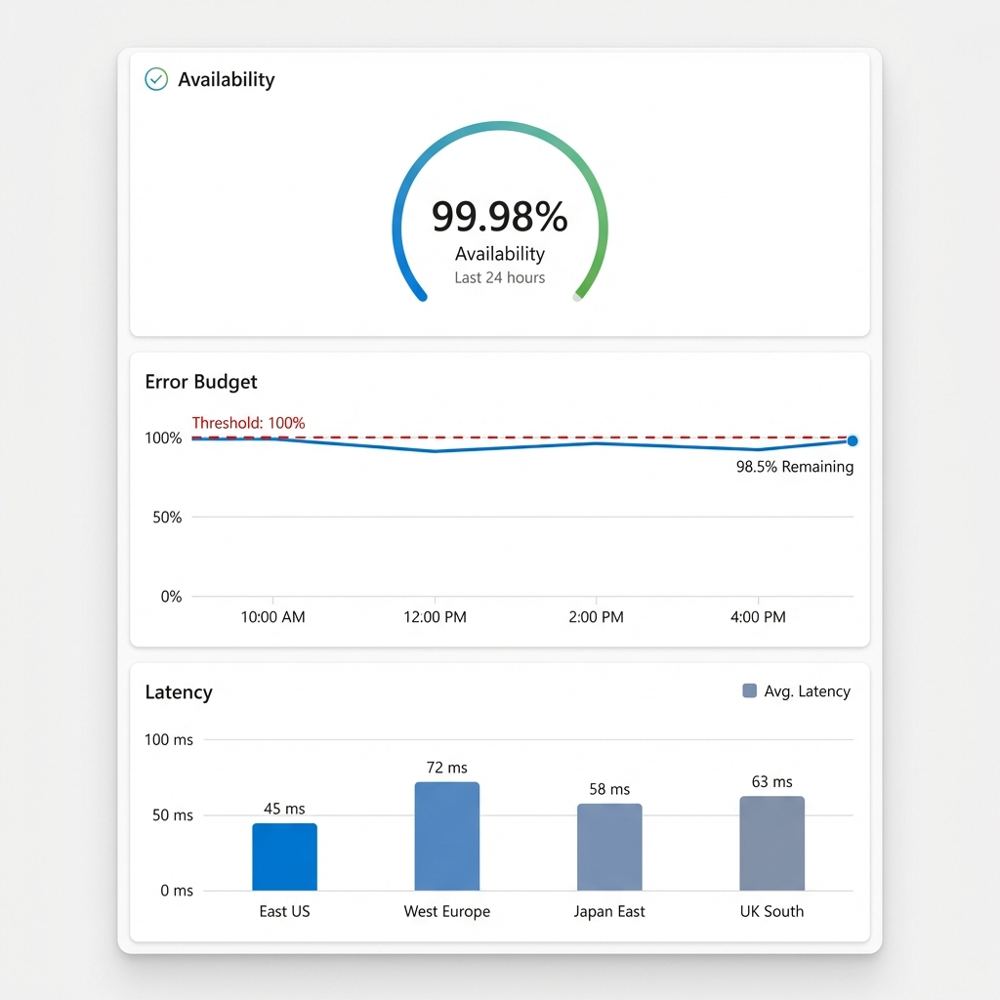

# SLI / SLO / Error Budget Definitions

This document defines the Service Level Indicators (SLIs), Service Level Objectives (SLOs), and Error Budgets for the CloudScale Event Intelligence Platform.

## Service Level Indicators (SLIs)

| SLI | Description | Measurement |
|-----|-------------|-------------|
| **Availability** | Percentage of successful requests (non-5xx) | `1 - (5xx_responses / total_responses)` |
| **Ingestion Latency** | Time from API request to Service Bus publish | `cloudscale_ingestion_duration_seconds` p99 |
| **Processing Latency** | Time from message receive to Cosmos DB write | `cloudscale_processing_duration_seconds` p99 |
| **Throughput** | Events successfully ingested per minute | `rate(cloudscale_events_ingested_total[1m])` |
| **Fraud Detection Accuracy** | True positive rate for fraud detection | Manual audit sampling |
| **Durability (Cold Store)** | Success rate of Blob Storage archival | `archival_success / total_processed` |
| **Capacity Saturation** | Percentage of requests throttled (429) | `429_responses / total_requests` |

## Service Level Objectives (SLOs)

| SLO | Target | Window | Priority |
|-----|--------|--------|----------|
| **Availability** | 99.9% | 30 days rolling | P0 |
| **Ingestion Latency p99** | < 200ms | 30 days rolling | P1 |
| **Processing Latency p99** | < 2s | 30 days rolling | P1 |
| **Throughput** | ≥ 10,000 events/min | Peak hours | P1 |
| **Error Rate** | < 0.1% | 30 days rolling | P0 |

## Error Budget Calculation

### Monthly Error Budget (30 days)

| SLO Target | Allowed Downtime | Allowed Failures (at 10k events/min) |
|------------|------------------|--------------------------------------|
| 99.9% | 43.2 minutes | ~4,320 failed events |
| 99.95% | 21.6 minutes | ~2,160 failed events |
| 99.99% | 4.32 minutes | ~432 failed events |

### Error Budget Policies

1. **Budget > 50% remaining**: Normal development velocity
2. **Budget 25-50%**: Increased focus on reliability
3. **Budget < 25%**: Feature freeze, reliability focus only
4. **Budget exhausted**: Incident response mode

## Alerting Rules

### Critical (P0) - PagerDuty

| Alert | Condition | Action |
|-------|-----------|--------|
| `HighErrorRate` | Error rate > 5% for 5min | Page on-call |
| `ServiceDown` | No successful requests for 2min | Page on-call |
| `QueueBacklog` | Queue depth > 50,000 for 10min | Page on-call |

### Warning (P1) - Slack

| Alert | Condition | Action |
|-------|-----------|--------|
| `HighLatency` | p99 > 500ms for 10min | Slack #alerts |
| `QueueGrowth` | Queue depth > 10,000 | Slack #alerts |
| `RateLimitSpike` | 429 responses > 100/min | Slack #alerts |
| `FraudSpike` | Fraud detections > 50/min | Slack #security |

### Info - Dashboard Only

| Alert | Condition |
|-------|-----------|
| `ElevatedLatency` | p99 > 300ms |
| `ApproachingCapacity` | CPU > 70% |
| `CircuitBreakerOpen` | Any circuit opened |

## Monitoring Dashboards

### Required Panels

1. **Overview**
   - Request rate (RPM)
   - Error rate (%)
   - p50/p95/p99 latency

2. **Event Pipeline**
   - Events ingested/processed
   - Queue depth over time
   - Fraud detection rate

3. **Infrastructure**
   - CPU/Memory by service
   - Cosmos RU consumption
   - Service Bus message throughput

4. **SLO Burn Rate**
   - Error budget remaining
   - Burn rate (fast/slow)
   - SLO compliance %

## Incident Response

### Severity Classification

| Severity | Impact | Response Time | Example |
|----------|--------|---------------|---------|
| SEV1 | Complete outage | 5 min | API returning 100% 5xx |
| SEV2 | Partial outage | 15 min | Processing backlog > 1hr |
| SEV3 | Degraded | 1 hr | Elevated latency |
| SEV4 | Minor | 24 hr | Single tenant impact |

### Escalation Path

1. On-call Engineer (SEV1-3)
2. Team Lead (SEV1-2, or SEV3 > 30min)
3. Engineering Manager (SEV1 > 15min)
