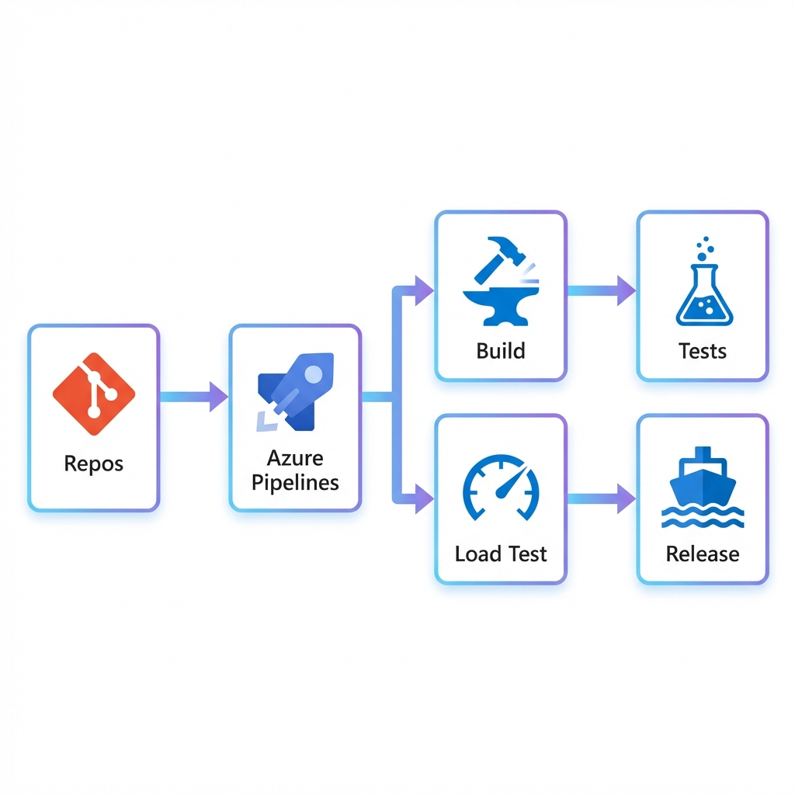

# Testing Documentation



This document describes the testing strategy and coverage for the CloudScale Event Intelligence Platform.

## Test Pyramid

```
                    ╭──────────────────╮
                    │  E2E / Chaos     │  ← Manual/Automated
                    │    Tests         │
                    ╰────────┬─────────╯
               ╭─────────────┴─────────────╮
               │     Integration Tests     │  ← Testcontainers
               ╰────────────┬──────────────╯
        ╭───────────────────┴───────────────────╮
        │           Unit Tests                  │  ← xUnit + Moq
        ╰───────────────────────────────────────╯
```

---

## Unit Tests

### Location
`tests/CloudScale.EventProcessor.Tests/`
`tests/CloudScale.IngestionApi.Tests/`

### Coverage

| Service | Tests | Coverage |
|---------|-------|----------|
| FraudDetectionService | 3 | Velocity limits, edge cases |
| UserScoringService | 2 | Score calculation, updates |
| RateLimitingMiddleware | 3 | Token bucket, sliding window |

### Running Unit Tests

```bash
# All unit tests
dotnet test tests/CloudScale.EventProcessor.Tests
dotnet test tests/CloudScale.IngestionApi.Tests

# With coverage
dotnet test --collect:"XPlat Code Coverage"
```

---

## Integration Tests

### Location
`tests/CloudScale.Integration.Tests/`

### Scenarios

| Scenario | Description |
|----------|-------------|
| Event Ingestion | API → Service Bus → Processor → Cosmos |
| Fraud Detection E2E | High-velocity requests trigger fraud flag |
| DLQ Processing | Poison messages dead-lettered correctly |

### Running Integration Tests

```bash
# Start emulators first
docker compose up cosmosdb-emulator servicebus-emulator -d

# Run tests
dotnet test tests/CloudScale.Integration.Tests
```

---

## Load Tests

### Scripts

| Script | Purpose | Target |
|--------|---------|--------|
| `load_test_stable.py` | Sustained load | 1000 RPS / 60s |
| `load_test_batch.py` | Batch ingestion | 10k events/batch |
| `load_test_10k.py` | Peak capacity | 10k RPS |
| `stress_test.py` | Extreme Stress | Dynamic Ramp-up + Chaos |
| `test_rate_limiting.py` | Rate limit validation | 150 burst |

### Running Load Tests

```bash
# Activate Python environment
source .venv/bin/activate

# Stable load test
python load_test_stable.py --duration 60 --target-rps 1000

# Rate limiting test
python test_rate_limiting.py
```

### Expected Results

| Test | Success Rate | p99 Latency |
|------|--------------|-------------|
| Stable 1k RPS | > 99% | < 200ms |
| Rate Limit Test | ~66% (150 req, 100 limit) | N/A |
| 10k RPS Peak | > 90% | < 500ms |

---

## Chaos Tests

### Script
`test_chaos.py`

### Scenarios

| Scenario | Command | Expected Behavior |
|----------|---------|-------------------|
| 10x Traffic Spike | `python test_chaos.py spike` | Rate limiting, no crashes |
| Poison Messages | `python test_chaos.py poison` | 400 responses, no crashes |
| Slow Consumer | `python test_chaos.py slow` | Queue builds, backpressure |
| Network Partition | `python test_chaos.py network` | Retries, eventual success |
| Multi-Tenant Flood | `python test_chaos.py flood` | Tenant isolation holds |

### Running Chaos Tests

```bash
# Single scenario
python test_chaos.py spike

# All scenarios
python test_chaos.py all
```

---

## Data Integrity Tests

### Script
`verify_data_integrity.py`

### Validation
1. Send N events
2. Query Cosmos DB
3. Verify count matches
4. Verify no data corruption

```bash
python verify_data_integrity.py
```

---

## CI/CD Test Integration

### GitHub Actions Pipeline

```yaml
# .github/workflows/ci-cd.yml
jobs:
  build:
    - Run unit tests
    - Run integration tests (with emulators)
    - Generate coverage report
```

---

## Test Environment Setup

### Prerequisites

```bash
# 1. Docker for emulators
docker compose up -d

# 2. Python for load tests
python3 -m venv .venv
source .venv/bin/activate
pip install aiohttp

# 3. .NET for unit/integration tests
dotnet restore
```

### Health Check

```bash
# Verify API is running
curl http://localhost:5000/health

# Verify processor is running
docker logs cloudscale-event-processor --tail 20
```

---

## Test Data

### Sample Events

```json
{
  "eventType": "page_view",
  "correlationId": "test-123",
  "tenantId": "acme",
  "url": "/home",
  "userId": "user-1",
  "metadata": {"ClientIp": "192.168.1.1"}
}
```

### Fraud Trigger

Send > 10 events with same `ClientIp` in < 1 minute.

---

## Monitoring Test Results

### Dashboards
- Application Insights → Test run traces
- Dashboard localhost:5173 → Real-time metrics

### Logs

```bash
# API logs
docker logs cloudscale-ingestion-api -f

# Processor logs
docker logs cloudscale-event-processor -f
```
